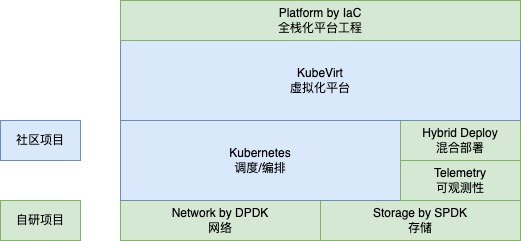

# 公司产品

## 什么是超融合

超融合旨在打破传统IaaS对固化设备的依赖，仅需管理开放架构的普通服务器。软件和硬件虚拟化逐步走向成熟，超融合将软硬件虚拟化进行有机结合。

+ 软件定义计算（SDC）：硬件资源池化管理，按需取用弹性伸缩，支持GPU/DSA之类的扩展；
+ 软件定义网络（SDN）：可编程网络设备成为主流，网络协议和流量治理不再受制于固件；
+ 软件定义存储（SDS）：形如NVMeoF的分布式存储取代需要专有硬件的存储区域网络SAN。

## 产品定位
 
Kubernetes是分布式操作系统内核，我们的目标是打造软硬件融合的的分布式操作系统。
## 产品功能

+ 主机管理：维护物理机节点
+ 虚拟机管理：管理虚拟机生命周期，访问虚拟机实例
+ 卷管理：支持卷克隆、卷导出和卷快照
+ 镜像管理：通过URL下载或本地上传镜像
+ 网络管理：多租户网络隔离和网络策略管理
+ 备份恢复：从备份或快照恢复虚拟机
+ 其他功能：CloudInit模板管理和PCIe设备管理

## 技术规划

+ 掌控DPDK+OVS/VPP/P4技术组合，定制高性能Kubernetes CNI网络插件，支持无缝对接智能网卡；
+ 在高性能网络的基础上，结合SPDK实现NVMeoF架构的分布式存储，以CSI方式接入Kubernetes；
+ 基于OpenTelemetry定制可观测性系统，结合Kubernetes HPA/VPA和KEDA实现平直弹性伸缩；
+ 参考Virtual Kubelet技术实现在离线混部系统，对观测数据进行量化分析，精细控制任务调度；
+ 跟进Infrastructure as Code（基础设施即代码）发展，做到超融合系统和平台工程水乳交融。

## 架构设计

## 使用Kubernetes作为超融合系统底座有什么优势

+ Kubernetes硬件上适配大多数X86和ARM服务器，软件上适配主流的Linux发行版，对云边协同这种复杂环境也很友好。部署时需求宽松，可以节省很多成本；
+ Kubernetes二次开发体系基本稳定，核心的编排和调度功能可以定制，算存网三种子系统支持灵活扩展多套并存，双网卡和快慢盘这类特殊场景也能应付自如；
+ Kubernetes可用于PaaS也可用于IaaS，如果额外用OpenStack之类的系统建设IaaS，维护重量级项目的心智负担和算存网等问题的复杂度接进近原地翻倍。

> Kubernetes内置一些分布式任务编排调度功能，OpenStack不具备这些功能，到哪都躲不开计算网络存储三个催命鬼

## 在离线混部的技术价值

+ 云计算场景下的资源碎片化问题存在日久，因为行业增长放缓加上全国经济下行，降本增效成为企业发展的刚需，在离线混布的落地被头部公司纷纷提上日程。不同任务对资源的需求千差万别，专机专用和资源超配造成的浪费有目共睹。
+ 在离线混布告别了以往【不差钱】式的心态和做法，转向精细化的资源管理和任务调度，达到降本增效的目的。FinOps的提出和可观测性的兴起与此不无关系，客观上也促进了微服务和大数据两套技术栈的融合。
+ 在混部系统的的作用下，当应用负载发生潮汐变化，无需人工干预，应用实例自发弹性伸缩，此消彼长之间做到物尽其用。平台层面做到根据观测结果自动进行水平伸缩和垂直伸缩，有时还需要考量操作系统和体系结构的干扰因素。